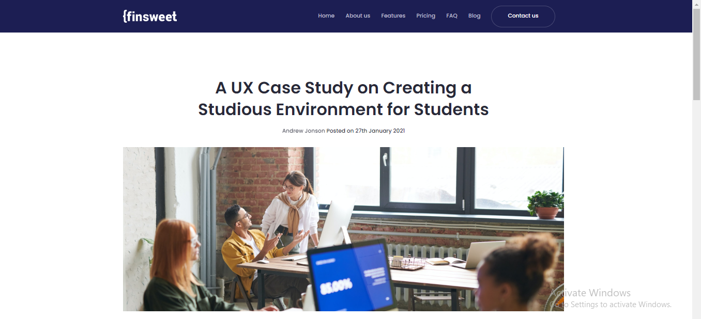
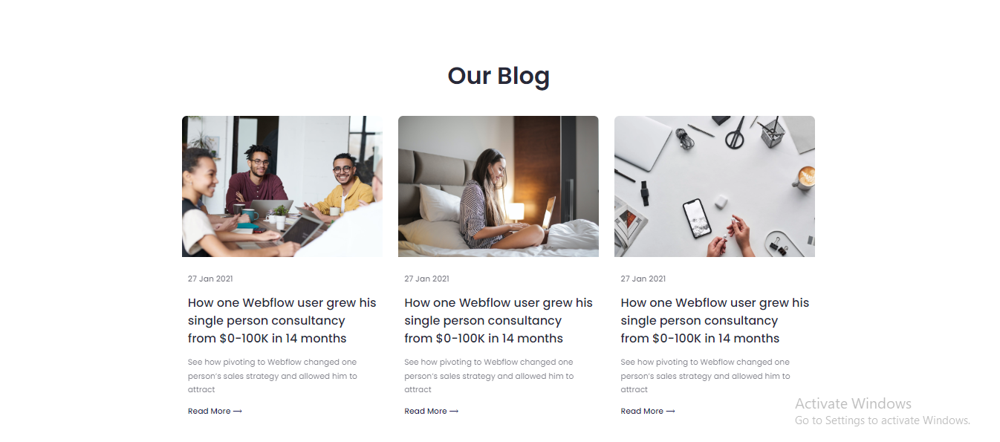
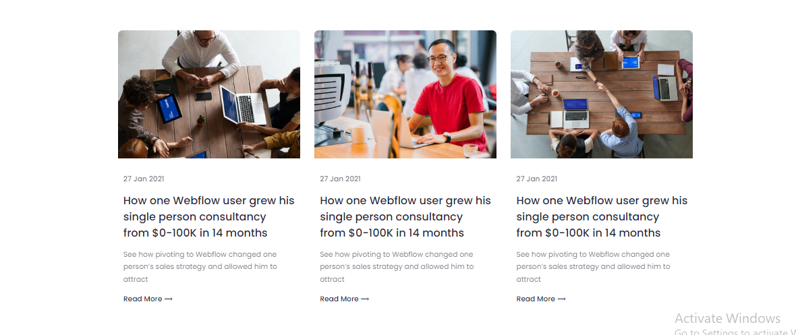
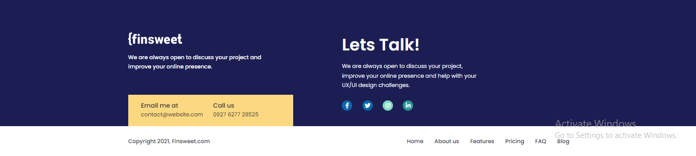

# Finsweet

# ✨ Finsweet Blog Project details:

### 🧨Here is the live link and screenshot of Finsweet Blog project by clicking on the image you will redirect to my github upload and others screenshot will redirect to code:

  

  

  

  

